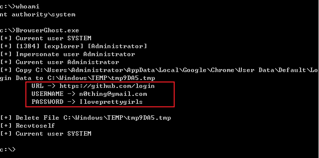

# BrowserGhost

## 介绍：

这是一个抓取浏览器密码的工具，后续会添加更多功能

## 优点：

- 实现system抓机器上其他用户的浏览器密码(方便横向移动时快速凭据采集)
- 用.net2 实现可兼容大部分windows，并去掉依赖(不需要System.Data.SQLite.dll这些累赘)
- 可以解密chrome全版本密码(chrome80版本后加密方式变了)

## 即将去做:

- 完善抓取更多信息(书签、密码、历史记录、cookie)
- 兼容主流浏览器(ie、firefox、360极速浏览器等)

